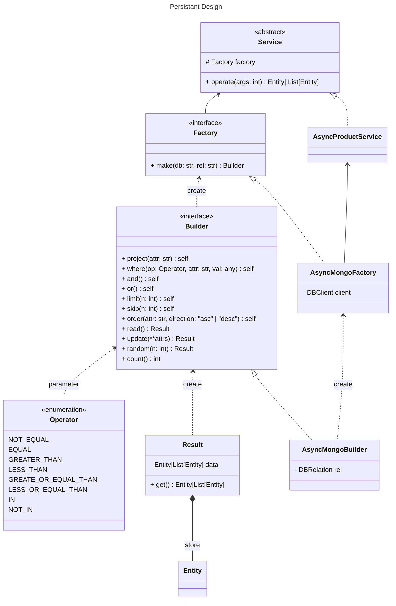

# Persistant
> DB 접근을 캡슐화한다
## Goal
1. DB 검색, 갱신 명령어를 캡슐화한다.
2. Service Layer에서 Builder를 이용해 Entities를 얻거나 DB Data를 조작할 수 있도록 한다.

## Design
> Builder + Factory를 중심으로 설계

```mermaid
---
title: Persistant Design
---
classDiagram
    class Service {
        <<abstract>>
        # Factory factory
        + operate(args: int) Entity| List[Entity]
    }
    class Factory {
        <<interface>>
        + make(db: str, rel: str) Builder
    }
    class Builder {
        <<interface>>
        + project(attr: str) self
        + where(op: Operator, attr: str, val: any) self
        + and() self
        + or() self
        + limit(n: int) self
        + skip(n: int) self
        + order(attr: str, direction: "asc" | "desc") self
        + read() Result
        + update(**attrs) Result
        + random(n: int) Result
        + count() int
    }
    class Operator {
        <<enumeration>>
        NOT_EQUAL
        EQUAL
        GREATER_THAN
        LESS_THAN
        GREATE_OR_EQUAL_THAN
        LESS_OR_EQUAL_THAN
        IN
        NOT_IN
    }
    class Result {
        - Entity|List[Entity] data
        + get() Entity|List[Entity]
    }

    Service <-- Factory
    Factory <.. Builder: create
    Builder <.. Result: create
    Builder <.. Operator: parameter
    Result *-- Entity: store

    Service <|.. AsyncProductService
    Factory <|.. AsyncMongoFactory
    AsyncMongoFactory: - DBClient client
    Builder <|.. AsyncMongoBuilder
    AsyncMongoBuilder: - DBRelation rel
    AsyncProductService <-- AsyncMongoFactory
    AsyncMongoFactory <.. AsyncMongoBuilder: create
```
