# API
## Architecture
> Microkernel based architecture

```mermaid
classDiagram
    note "Entities are coded by pure python"
    namespace Entity {
        class EntityIfs{
            <<interface>>
        }
        class ProductEntity
        class EventEntity
        class BrandEntity
    }
    ProductEntity ..|> EntityIfs
    EventEntity ..|> EntityIfs
    BrandEntity ..|> EntityIfs

    namespace Business {
        class BusinessIfs {
            <<interface>>
        }
        class BrandBusinessIfs {
            <<interface>>
        }
        class BrandBusiness
        class ProductBusinessIfs {
            <<interface>>
        }
        class ProductBusiness
        class EventBusinessIfs {
            <<interface>>
        }
        class EventBusiness
        class HomeBusinessIfs {
            <<interface>>
        }
        class HomeBusiness
        class MetricBusinessIfs {
            <<interface>>
        }
        class MetricBusiness
        class SearchBusinessIfs {
            <<interface>>
        }
        class SearchBusiness
        class ConverterIfs {
            <<interface>>
        }
        class DtoIfs {
            <<interface>>
        }
        class ServiceIfs {
            <<interface>>
        }
        class ProductServiceIfs {
            <<interface>>
        }
        class EventServiceIfs {
            <<interface>>
        }
        class ConstantBrandServiceIfs {
            <<interface>>
        }
        class SearchServiceIfs {
            <<interface>>
        }
    }
    BrandBusinessIfs --|> BusinessIfs
    ProductBusinessIfs --|> BusinessIfs
    EventBusinessIfs --|> BusinessIfs
    HomeBusinessIfs --|> BusinessIfs
    MetricBusinessIfs --|> BusinessIfs
    SearchBusinessIfs --|> BusinessIfs
    BusinessIfs --> ConverterIfs: convert entity<->dto
    BusinessIfs --* ServiceIfs: Access each domains

    ConverterIfs ..> DtoIfs: convert dto from entity
    ConverterIfs ..> EntityIfs: convert entity from dto

    ServiceIfs ..* EntityIfs: Make entities in a domain
    ProductServiceIfs --|> ServiceIfs
    EventServiceIfs --|> ServiceIfs
    ConstantBrandServiceIfs --|> ServiceIfs
    SearchServiceIfs --|> ServiceIfs

    BrandBusiness ..|> BrandBusinessIfs
    ProductBusiness ..|> ProductBusinessIfs
    EventBusiness ..|> EventBusinessIfs
    HomeBusiness ..|> HomeBusinessIfs
    MetricBusiness ..|> MetricBusinessIfs
    SearchBusiness ..|> SearchBusinessIfs

    namespace Service {
        class AbstractService {
            <<abstract>>
            #FactoryIfs factory
        }
        class ProductService
        class SearchService
        class EventService
        class ConstantBrandService
        class Builder {
            <<interface>>
        }
        class Factory {
            <<interface>>
        }
    }
    ProductService ..|> ProductServiceIfs
    ProductService --|> AbstractService
    SearchService ..|> SearchServiceIfs
    SearchService --|> AbstractService
    EventService ..|> EventServiceIfs
    EventService --|> AbstractService
    ConstantBrandService ..|> ConstantBrandServiceIfs
    ConstantBrandService --|> AbstractService
    AbstractService ..> Builder: access database
    AbstractService --> Factory: access database

    namespace Persistent {
        class AsyncMongoBuilder
        class AsyncMongoFactory
    }
    AsyncMongoBuilder ..|> Builder
    AsyncMongoFactory ..|> Factory
    AsyncMongoBuilder ..* EntityIfs: Convert raw data to entities

    namespace View {
        class ProductView
        class BrandView
        class EventView
        class HomeView
        class MetricView
        class SearchView
    }
    ProductView --> ProductBusinessIfs
    BrandView --> BrandBusinessIfs
    EventView --> EventBusinessIfs
    HomeView --> HomeBusinessIfs
    MetricView --> MetricBusinessIfs
    SearchView --> SearchBusinessIfs
```

- View, Business, Service, Persistant의 4 계층으로 구분
- 각 계층은 상위 계층의 Interface를 구현
- 계층 간에는 Interface를 통해서만 접근
- 의존성은 외부에서 주입
- Data Update의 경우, Update SQS로 데이터를 전송하는 것으로 대체
